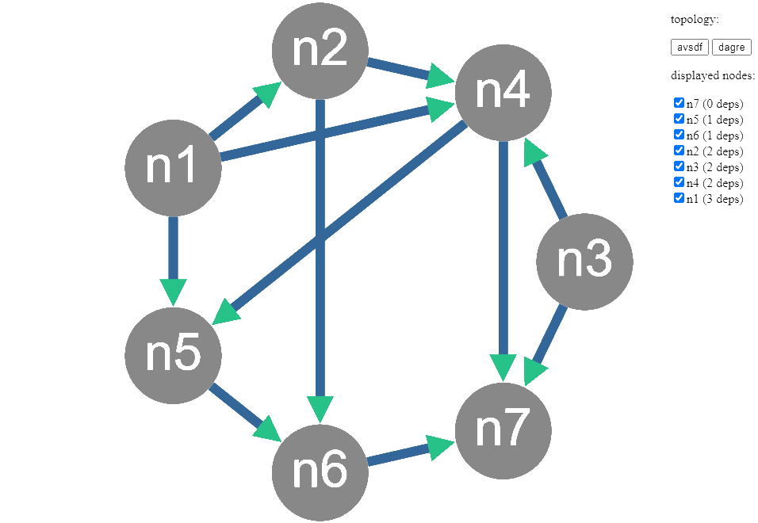

# make-dep-graph

[](https://github.com/harlamenko/make-dep-graph/blob/main/LICENSE)
[](https://github.com/harlamenko/make-dep-graph/stargazers)

Script that allows you to create a dependency graph.



## Usage

```
Usage: make-dep-graph ./path/to/file-with-data.json [options]

Creates a directed graph from the provided json and opens it in the browser.

Options:
  -p, --port <value>  Allows to specify a port to use.
```

## Data format

```json
[
	{ "name": "n1", "deps": ["n2", "n4", "n5"] },
	{ "name": "n2", "deps": ["n4", "n6"] },
	{ "name": "n3", "deps": ["n4", "n7"] },
	{ "name": "n4", "deps": ["n5", "n7"] },
	{ "name": "n5", "deps": ["n6"] },
	{ "name": "n6", "deps": ["n7"] },
	{ "name": "n7", "deps": [] }
]
```
